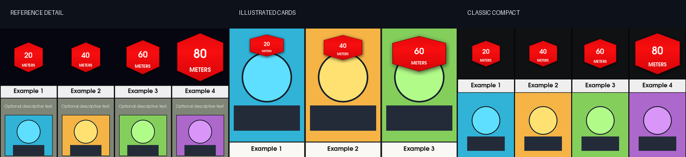

# CTS — Comparison Timeline Studio


CTS is a free desktop editor for creating continuously scrolling comparison videos.
Edit cards directly on the rendered preview, fill hundreds of cards from a spreadsheet,
add a soundtrack, and export a finished H.264/AAC MP4 through FFmpeg.



## Why CTS?

Comparison videos are visually repetitive but surprisingly annoying to build by hand.
CTS keeps the design consistent while making the content fast to edit:

- Click a badge, title, description, image, or artwork directly in the preview.
- Paste a copied image URL straight into a card from its image menu.
- Import arbitrary `.xlsx` tables or paste spreadsheet cells with Ctrl+V.
- Switch between three built-in visual models without rebuilding the project.
- Split one large image strip into card artwork using divider detection.
- Layer, trim, delay, loop, fade, and mix multiple soundtrack files.
- Preview the exact deterministic renderer used for export.
- Export with visible stage progress, frame count, percentage, ETA, and cancellation.
- Receive readable errors instead of raw encoder or spreadsheet failures.

## Visual models

Each model prepares only the fields its layout actually uses. Cells may remain blank;
CTS never invents card content.

| Model | Prepared fields | Native viewport |
| --- | --- | ---: |
| Reference Detail | Badge Date / Value, Title, Description, Image | 4 cards |
| Illustrated Cards | Badge Value, Badge Label, Title, Artwork | 3 cards |
| Classic Compact | Value, Unit, Title, Image | 4 cards |

Switching models migrates compatible values and preserves non-empty extra spreadsheet
fields. The in-app field guide explains exactly where every value appears.
Classic Compact automatically shrinks and wraps long values, units, and titles—including
continuous strings without spaces—so text remains inside the card.

## Direct editing

The preview is the main editor. Text editing is truly in-place: the rendered value is
temporarily removed and a borderless caret appears inside that exact visual region—no
floating input box.

- Click the red badge to edit its large value or smaller label/unit.
- Click the white strip to edit the title.
- Click the muted panel in Reference Detail to edit the description.
- Click an image area to choose a file, paste an image URL, type a local path/URL, or clear it.
- Press **Enter** to apply an inline edit or **Esc** to cancel it.
- Click **Add card** beside playback to create and reveal another card.

The **Hexagons bounce** checkbox lives under the preview in the separate **Animation**
row—it is a motion setting, not a visual model. Disable it to keep every red badge at a
fixed scale during entrances and horizontal scrolling. The setting is saved per project.

Hit-testing follows the real animated positions, including partially scrolled cards.
Every visual edit updates the underlying spreadsheet table immediately.

## Spreadsheet and image-strip workflow

One table row is one card. You can type into the grid, paste cells, paste a complete
table, or import the active sheet from an XLSX workbook. Recognizable fields are mapped
automatically; unusual headers can be assigned from **Models → Advanced mapping** or by
right-clicking a field.

Images may be:

- absolute or workbook-relative local paths;
- HTTP(S) URLs;
- embedded XLSX images;
- selected through the preview or row image picker;
- cuts from a horizontal or vertical image strip.

The strip importer detects uniform dividers at least two pixels thick, previews every
cut, rejects silent count mismatches, and also offers equal slicing.

## Soundtrack

Each Soundtrack row is an independent layer with:

- timeline start time;
- Trim In and optional Trim Out;
- per-track volume;
- Fade In and Fade Out;
- trimmed-region looping;
- project master volume.

FFmpeg resamples layers to 48 kHz, mixes and limits them, then writes AAC at 256 kb/s.
Projects without soundtrack rows export as video-only MP4 files.

## Install on Ubuntu or Debian

Install the operating-system dependencies:

```bash
sudo apt update
sudo apt install python3-venv ffmpeg fonts-urw-base35
```

Clone and run CTS inside a virtual environment:

```bash
git clone https://github.com/RetroFrost/CTS.git
cd CTS
python3 -m venv .venv
source .venv/bin/activate
python -m pip install --upgrade pip
python -m pip install -r requirements.txt
python run.py
```

Later launches only need:

```bash
cd CTS
source .venv/bin/activate
python run.py
```

After `pip install .`, the packaged launcher is also available:

```bash
comparison-timeline-studio
```

Do not use `sudo pip` or `--break-system-packages`.

## Timing and export

Automatic timing follows the established comparison-video motion:

- cards enter two seconds apart until the viewport fills;
- the strip moves one card width every 3⅓ seconds;
- the final viewport holds for two seconds;
- the picture fades over 0.8 seconds.

You can enter any custom total duration. CTS scales the complete animation to fit, so a
shorter duration intentionally increases card speed and a longer duration slows it down.

The default export is 1920×1080 at 30 FPS using H.264 (`yuv420p`) and optional AAC audio.

## Development

```bash
python -m unittest discover -s tests -v
python tools/render_models_qa.py
python tools/export_smoke_test.py
python tools/export_soundtrack_smoke.py
```

The current suite covers generic data import, model schemas, project migration, timing,
all direct-edit hit regions and editor rectangles, scrolling positions, fixed/bouncing
hexagons, image-strip detection, rendering, and soundtrack filter generation. Real
FFmpeg smoke tests validate both silent and mixed H.264/AAC output.

### Source layout

```text
comparison_studio/
  app.py             Application entry point
  ui.py              Qt Widgets interface and direct editing
  data.py            Tables, models, projects, and XLSX import
  renderer.py        Deterministic frame renderer and hit-testing
  exporter.py        Progress-aware FFmpeg export worker
  soundtrack.py      Audio probing and filter graph construction
  strip_splitter.py  Divider detection and image extraction
tests/                Standard-library unittest suite
tools/                Visual and FFmpeg QA scripts
```

## Documentation

The project wiki is being built at the [CTS Wiki](https://github.com/RetroFrost/CTS/wiki).
Use it for longer tutorials, model-specific examples, spreadsheet templates, and release
notes as they are added.

## License

CTS is released under [CC0 1.0 Universal](LICENSE).
